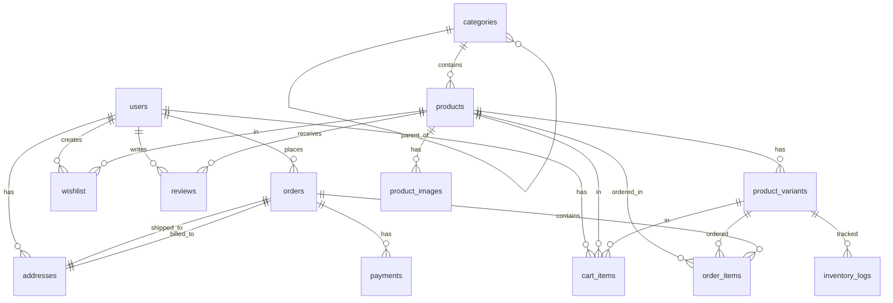

# Database Schema

## 📊 Database Tables

### 1. Users Table

**Purpose**: Store all user accounts (customers and admins)

```sql
CREATE TABLE users (
  id UUID PRIMARY KEY DEFAULT gen_random_uuid(),
  email VARCHAR(255) UNIQUE NOT NULL,
  password_hash VARCHAR(255) NOT NULL,
  first_name VARCHAR(100) NOT NULL,
  last_name VARCHAR(100) NOT NULL,
  phone VARCHAR(20),
  role ENUM('customer', 'admin', 'super_admin') DEFAULT 'customer',
  email_verified BOOLEAN DEFAULT FALSE,
  is_active BOOLEAN DEFAULT TRUE,
  created_at TIMESTAMP DEFAULT CURRENT_TIMESTAMP,
  updated_at TIMESTAMP DEFAULT CURRENT_TIMESTAMP,
  last_login TIMESTAMP
);

-- Indexes
CREATE INDEX idx_users_email ON users(email);
CREATE INDEX idx_users_role ON users(role);
```

### 2. Addresses Table

**Purpose**: Store customer shipping and billing addresses

```sql
CREATE TABLE addresses (
  id UUID PRIMARY KEY DEFAULT gen_random_uuid(),
  user_id UUID REFERENCES users(id) ON DELETE CASCADE,
  address_type ENUM('shipping', 'billing') NOT NULL,
  is_default BOOLEAN DEFAULT FALSE,
  full_name VARCHAR(200) NOT NULL,
  address_line1 VARCHAR(255) NOT NULL,
  address_line2 VARCHAR(255),
  city VARCHAR(100) NOT NULL,
  state VARCHAR(100) NOT NULL,
  postal_code VARCHAR(20) NOT NULL,
  country VARCHAR(100) NOT NULL,
  phone VARCHAR(20) NOT NULL,
  created_at TIMESTAMP DEFAULT CURRENT_TIMESTAMP,
  updated_at TIMESTAMP DEFAULT CURRENT_TIMESTAMP
);

-- Indexes
CREATE INDEX idx_addresses_user_id ON addresses(user_id);
CREATE INDEX idx_addresses_default ON addresses(is_default);
```

### 3. Categories Table

**Purpose**: Product categorization hierarchy

```sql
CREATE TABLE categories (
  id UUID PRIMARY KEY DEFAULT gen_random_uuid(),
  name VARCHAR(100) NOT NULL,
  slug VARCHAR(100) UNIQUE NOT NULL,
  description TEXT,
  parent_id UUID REFERENCES categories(id) ON DELETE SET NULL,
  image_url VARCHAR(500),
  display_order INT DEFAULT 0,
  is_active BOOLEAN DEFAULT TRUE,
  created_at TIMESTAMP DEFAULT CURRENT_TIMESTAMP,
  updated_at TIMESTAMP DEFAULT CURRENT_TIMESTAMP
);

-- Indexes
CREATE INDEX idx_categories_parent_id ON categories(parent_id);
CREATE INDEX idx_categories_slug ON categories(slug);
CREATE INDEX idx_categories_active ON categories(is_active);
```

### 4. Products Table

**Purpose**: Store product information

```sql
CREATE TABLE products (
  id UUID PRIMARY KEY DEFAULT gen_random_uuid(),
  name VARCHAR(255) NOT NULL,
  slug VARCHAR(255) UNIQUE NOT NULL,
  description TEXT,
  category_id UUID REFERENCES categories(id) ON DELETE SET NULL,
  sku VARCHAR(100) UNIQUE NOT NULL,
  base_price DECIMAL(10, 2) NOT NULL,
  sale_price DECIMAL(10, 2),
  cost_price DECIMAL(10, 2),
  is_active BOOLEAN DEFAULT TRUE,
  is_featured BOOLEAN DEFAULT FALSE,
  gender ENUM('men', 'women', 'unisex', 'kids') DEFAULT 'unisex',
  material VARCHAR(255),
  care_instructions TEXT,
  meta_title VARCHAR(255),
  meta_description TEXT,
  created_at TIMESTAMP DEFAULT CURRENT_TIMESTAMP,
  updated_at TIMESTAMP DEFAULT CURRENT_TIMESTAMP
);

-- Indexes
CREATE INDEX idx_products_category_id ON products(category_id);
CREATE INDEX idx_products_slug ON products(slug);
CREATE INDEX idx_products_sku ON products(sku);
CREATE INDEX idx_products_active ON products(is_active);
CREATE INDEX idx_products_featured ON products(is_featured);
```

### 5. Product Variants Table

**Purpose**: Handle different sizes, colors, etc.

```sql
CREATE TABLE product_variants (
  id UUID PRIMARY KEY DEFAULT gen_random_uuid(),
  product_id UUID REFERENCES products(id) ON DELETE CASCADE,
  sku VARCHAR(100) UNIQUE NOT NULL,
  size VARCHAR(50),
  color VARCHAR(50),
  stock_quantity INT DEFAULT 0,
  price_adjustment DECIMAL(10, 2) DEFAULT 0,
  is_available BOOLEAN DEFAULT TRUE,
  created_at TIMESTAMP DEFAULT CURRENT_TIMESTAMP,
  updated_at TIMESTAMP DEFAULT CURRENT_TIMESTAMP
);

-- Indexes
CREATE INDEX idx_variants_product_id ON product_variants(product_id);
CREATE INDEX idx_variants_sku ON product_variants(sku);
CREATE INDEX idx_variants_available ON product_variants(is_available);
```

### 6. Product Images Table

**Purpose**: Store multiple product images

```sql
CREATE TABLE product_images (
  id UUID PRIMARY KEY DEFAULT gen_random_uuid(),
  product_id UUID REFERENCES products(id) ON DELETE CASCADE,
  image_url VARCHAR(500) NOT NULL,
  alt_text VARCHAR(255),
  display_order INT DEFAULT 0,
  is_primary BOOLEAN DEFAULT FALSE,
  created_at TIMESTAMP DEFAULT CURRENT_TIMESTAMP
);

-- Indexes
CREATE INDEX idx_images_product_id ON product_images(product_id);
CREATE INDEX idx_images_primary ON product_images(is_primary);
```

### 7. Orders Table

**Purpose**: Store customer orders

```sql
CREATE TABLE orders (
  id UUID PRIMARY KEY DEFAULT gen_random_uuid(),
  order_number VARCHAR(50) UNIQUE NOT NULL,
  user_id UUID REFERENCES users(id) ON DELETE SET NULL,
  status ENUM('pending', 'processing', 'shipped', 'delivered', 'cancelled', 'refunded') DEFAULT 'pending',
  subtotal DECIMAL(10, 2) NOT NULL,
  tax_amount DECIMAL(10, 2) DEFAULT 0,
  shipping_amount DECIMAL(10, 2) DEFAULT 0,
  discount_amount DECIMAL(10, 2) DEFAULT 0,
  total_amount DECIMAL(10, 2) NOT NULL,
  currency VARCHAR(3) DEFAULT 'USD',
  shipping_address_id UUID REFERENCES addresses(id),
  billing_address_id UUID REFERENCES addresses(id),
  customer_notes TEXT,
  admin_notes TEXT,
  created_at TIMESTAMP DEFAULT CURRENT_TIMESTAMP,
  updated_at TIMESTAMP DEFAULT CURRENT_TIMESTAMP,
  shipped_at TIMESTAMP,
  delivered_at TIMESTAMP
);

-- Indexes
CREATE INDEX idx_orders_user_id ON orders(user_id);
CREATE INDEX idx_orders_order_number ON orders(order_number);
CREATE INDEX idx_orders_status ON orders(status);
CREATE INDEX idx_orders_created_at ON orders(created_at);
```

### 8. Order Items Table

**Purpose**: Store individual items in each order

```sql
CREATE TABLE order_items (
  id UUID PRIMARY KEY DEFAULT gen_random_uuid(),
  order_id UUID REFERENCES orders(id) ON DELETE CASCADE,
  product_id UUID REFERENCES products(id) ON DELETE SET NULL,
  variant_id UUID REFERENCES product_variants(id) ON DELETE SET NULL,
  product_name VARCHAR(255) NOT NULL,
  variant_details VARCHAR(255),
  quantity INT NOT NULL,
  unit_price DECIMAL(10, 2) NOT NULL,
  total_price DECIMAL(10, 2) NOT NULL,
  created_at TIMESTAMP DEFAULT CURRENT_TIMESTAMP
);

-- Indexes
CREATE INDEX idx_order_items_order_id ON order_items(order_id);
CREATE INDEX idx_order_items_product_id ON order_items(product_id);
```

### 9. Shopping Cart Table

**Purpose**: Store active shopping carts

```sql
CREATE TABLE cart_items (
  id UUID PRIMARY KEY DEFAULT gen_random_uuid(),
  user_id UUID REFERENCES users(id) ON DELETE CASCADE,
  product_id UUID REFERENCES products(id) ON DELETE CASCADE,
  variant_id UUID REFERENCES product_variants(id) ON DELETE CASCADE,
  quantity INT NOT NULL DEFAULT 1,
  created_at TIMESTAMP DEFAULT CURRENT_TIMESTAMP,
  updated_at TIMESTAMP DEFAULT CURRENT_TIMESTAMP
);

-- Indexes
CREATE INDEX idx_cart_user_id ON cart_items(user_id);
CREATE INDEX idx_cart_product_id ON cart_items(product_id);
```

### 10. Wishlist Table

**Purpose**: Store customer wishlists

```sql
CREATE TABLE wishlist (
  id UUID PRIMARY KEY DEFAULT gen_random_uuid(),
  user_id UUID REFERENCES users(id) ON DELETE CASCADE,
  product_id UUID REFERENCES products(id) ON DELETE CASCADE,
  created_at TIMESTAMP DEFAULT CURRENT_TIMESTAMP
);

-- Indexes
CREATE INDEX idx_wishlist_user_id ON wishlist(user_id);
CREATE INDEX idx_wishlist_product_id ON wishlist(product_id);
CREATE UNIQUE INDEX idx_wishlist_unique ON wishlist(user_id, product_id);
```

### 11. Reviews Table

**Purpose**: Store product reviews

```sql
CREATE TABLE reviews (
  id UUID PRIMARY KEY DEFAULT gen_random_uuid(),
  product_id UUID REFERENCES products(id) ON DELETE CASCADE,
  user_id UUID REFERENCES users(id) ON DELETE CASCADE,
  order_id UUID REFERENCES orders(id) ON DELETE SET NULL,
  rating INT CHECK (rating >= 1 AND rating <= 5) NOT NULL,
  title VARCHAR(255),
  comment TEXT,
  is_verified_purchase BOOLEAN DEFAULT FALSE,
  is_approved BOOLEAN DEFAULT FALSE,
  created_at TIMESTAMP DEFAULT CURRENT_TIMESTAMP,
  updated_at TIMESTAMP DEFAULT CURRENT_TIMESTAMP
);

-- Indexes
CREATE INDEX idx_reviews_product_id ON reviews(product_id);
CREATE INDEX idx_reviews_user_id ON reviews(user_id);
CREATE INDEX idx_reviews_approved ON reviews(is_approved);
```

### 12. Coupons Table

**Purpose**: Manage discount codes and promotions

```sql
CREATE TABLE coupons (
  id UUID PRIMARY KEY DEFAULT gen_random_uuid(),
  code VARCHAR(50) UNIQUE NOT NULL,
  description TEXT,
  discount_type ENUM('percentage', 'fixed') NOT NULL,
  discount_value DECIMAL(10, 2) NOT NULL,
  min_purchase_amount DECIMAL(10, 2),
  max_discount_amount DECIMAL(10, 2),
  usage_limit INT,
  usage_count INT DEFAULT 0,
  per_user_limit INT DEFAULT 1,
  is_active BOOLEAN DEFAULT TRUE,
  starts_at TIMESTAMP,
  expires_at TIMESTAMP,
  created_at TIMESTAMP DEFAULT CURRENT_TIMESTAMP,
  updated_at TIMESTAMP DEFAULT CURRENT_TIMESTAMP
);

-- Indexes
CREATE INDEX idx_coupons_code ON coupons(code);
CREATE INDEX idx_coupons_active ON coupons(is_active);
```

### 13. Payments Table

**Purpose**: Track payment transactions

```sql
CREATE TABLE payments (
  id UUID PRIMARY KEY DEFAULT gen_random_uuid(),
  order_id UUID REFERENCES orders(id) ON DELETE CASCADE,
  payment_method ENUM('credit_card', 'debit_card', 'paypal', 'stripe', 'cash_on_delivery') NOT NULL,
  payment_status ENUM('pending', 'completed', 'failed', 'refunded') DEFAULT 'pending',
  amount DECIMAL(10, 2) NOT NULL,
  currency VARCHAR(3) DEFAULT 'USD',
  transaction_id VARCHAR(255),
  payment_gateway_response TEXT,
  created_at TIMESTAMP DEFAULT CURRENT_TIMESTAMP,
  updated_at TIMESTAMP DEFAULT CURRENT_TIMESTAMP
);

-- Indexes
CREATE INDEX idx_payments_order_id ON payments(order_id);
CREATE INDEX idx_payments_status ON payments(payment_status);
CREATE INDEX idx_payments_transaction_id ON payments(transaction_id);
```

### 14. Inventory Logs Table

**Purpose**: Track inventory changes

```sql
CREATE TABLE inventory_logs (
  id UUID PRIMARY KEY DEFAULT gen_random_uuid(),
  variant_id UUID REFERENCES product_variants(id) ON DELETE CASCADE,
  change_type ENUM('restock', 'sale', 'adjustment', 'damaged', 'return') NOT NULL,
  quantity_change INT NOT NULL,
  previous_quantity INT NOT NULL,
  new_quantity INT NOT NULL,
  reason TEXT,
  created_by UUID REFERENCES users(id),
  created_at TIMESTAMP DEFAULT CURRENT_TIMESTAMP
);

-- Indexes
CREATE INDEX idx_inventory_variant_id ON inventory_logs(variant_id);
CREATE INDEX idx_inventory_created_at ON inventory_logs(created_at);
```

## 🔗 Entity Relationships



## 📝 Notes

- Use UUIDs for better scalability and security
- All timestamps are in UTC
- Soft deletes can be implemented with `deleted_at` columns
- Consider adding full-text search indexes for product names and descriptions
- Implement proper foreign key constraints and cascading rules
- Use database migrations for schema management
