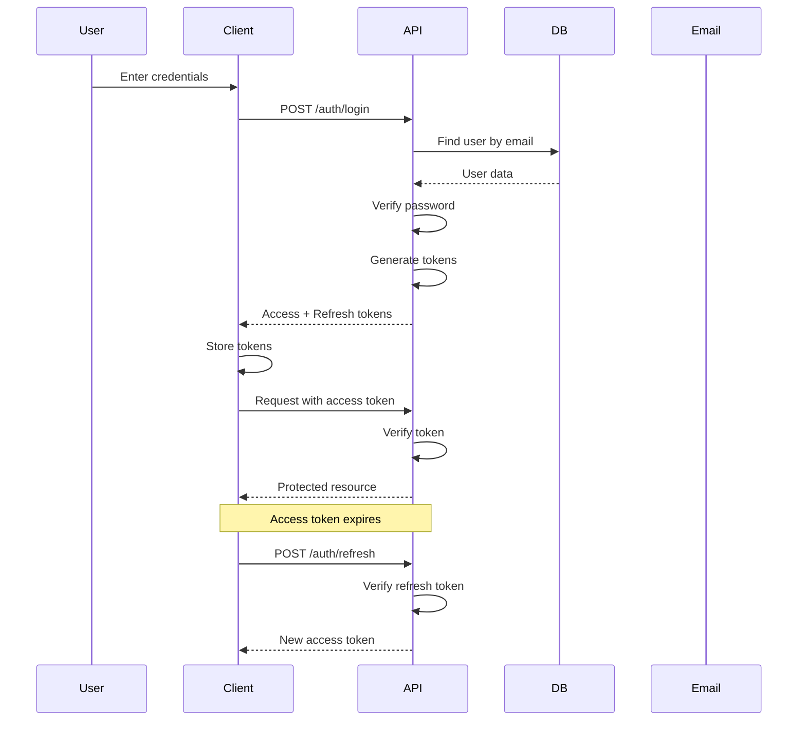

# Authentication & Authorization

## 🔐 Authentication Flow

### User Registration

**Endpoint**: `POST /api/auth/register`

**Process**:

1. User submits registration form (email, password, name)
2. Validate email format and password strength
3. Check if email already exists
4. Hash password using bcrypt (salt rounds: 12)
5. Create user record with `email_verified: false`
6. Generate email verification token (JWT, 24h expiry)
7. Send verification email
8. Return success message

**Required Fields**:

```json
{
  "email": "user@example.com",
  "password": "SecurePass123!",
  "first_name": "John",
  "last_name": "Doe",
  "phone": "+1234567890"
}
```

**Password Requirements**:

- Minimum 8 characters
- At least 1 uppercase letter
- At least 1 lowercase letter
- At least 1 number
- At least 1 special character

---

### User Login

**Endpoint**: `POST /api/auth/login`

**Process**:

1. User submits email and password
2. Find user by email
3. Verify password hash
4. Check if user is active and email verified
5. Generate access token (JWT, 15min expiry)
6. Generate refresh token (JWT, 7 days expiry)
7. Update `last_login` timestamp
8. Return tokens and user data

**Request**:

```json
{
  "email": "user@example.com",
  "password": "SecurePass123!"
}
```

**Response**:

```json
{
  "user": {
    "id": "uuid",
    "email": "user@example.com",
    "first_name": "John",
    "last_name": "Doe",
    "role": "customer"
  },
  "access_token": "eyJhbGc...",
  "refresh_token": "eyJhbGc..."
}
```

---

### Email Verification

**Endpoint**: `GET /api/auth/verify-email/:token`

**Process**:

1. Extract token from URL
2. Verify JWT token validity
3. Extract user ID from token
4. Update `email_verified: true`
5. Redirect to login page with success message

---

### Password Reset

**Endpoints**:

- Request: `POST /api/auth/forgot-password`
- Reset: `POST /api/auth/reset-password`

**Request Reset Process**:

1. User submits email
2. Find user by email
3. Generate password reset token (JWT, 1h expiry)
4. Send reset email with token link
5. Return success message

**Reset Password Process**:

1. User submits new password with token
2. Verify token validity
3. Validate new password
4. Hash new password
5. Update user password
6. Invalidate all existing refresh tokens
7. Send confirmation email

---

### Token Refresh

**Endpoint**: `POST /api/auth/refresh`

**Process**:

1. User submits refresh token
2. Verify refresh token
3. Check if token is blacklisted
4. Generate new access token
5. Optionally rotate refresh token
6. Return new tokens

---

### Logout

**Endpoint**: `POST /api/auth/logout`

**Process**:

1. Add refresh token to blacklist
2. Clear client-side tokens
3. Return success

---

## 👤 Authorization Levels

### 1. Customer (Default)

**Permissions**:

- View products and categories
- Manage own profile
- Create and manage cart
- Place orders
- View own order history
- Write product reviews
- Manage wishlist

**Protected Routes**:

- `/account/*`
- `/checkout/*`
- `/orders/*`

---

### 2. Admin

**Permissions**:

- All customer permissions
- Manage products (CRUD)
- Manage categories (CRUD)
- View all orders
- Update order status
- Manage inventory
- View customer list
- Approve/reject reviews
- Manage coupons

**Protected Routes**:

- `/admin/*`
- `/admin/products/*`
- `/admin/orders/*`
- `/admin/customers/*`
- `/admin/inventory/*`

---

### 3. Super Admin

**Permissions**:

- All admin permissions
- Manage admin users
- View analytics and reports
- System configuration
- Manage payments
- Access logs and audit trail

**Protected Routes**:

- `/admin/users/*`
- `/admin/settings/*`
- `/admin/analytics/*`

---

## 🛡️ Security Measures

### Password Security

```javascript
// Hash password
const bcrypt = require("bcrypt");
const saltRounds = 12;
const hashedPassword = await bcrypt.hash(password, saltRounds);

// Verify password
const isValid = await bcrypt.compare(password, hashedPassword);
```

### JWT Configuration

```javascript
// Access Token
{
  payload: {
    user_id: 'uuid',
    email: 'user@example.com',
    role: 'customer'
  },
  secret: process.env.JWT_ACCESS_SECRET,
  expiresIn: '15m'
}

// Refresh Token
{
  payload: {
    user_id: 'uuid',
    type: 'refresh'
  },
  secret: process.env.JWT_REFRESH_SECRET,
  expiresIn: '7d'
}
```

### Middleware Implementation

**Auth Middleware**:

```javascript
async function authenticate(req, res, next) {
  try {
    const token = req.headers.authorization?.split(" ")[1];
    if (!token) return res.status(401).json({ error: "No token provided" });

    const decoded = jwt.verify(token, process.env.JWT_ACCESS_SECRET);
    const user = await User.findById(decoded.user_id);

    if (!user || !user.is_active) {
      return res.status(401).json({ error: "Invalid token" });
    }

    req.user = user;
    next();
  } catch (error) {
    return res.status(401).json({ error: "Invalid token" });
  }
}
```

**Role-Based Middleware**:

```javascript
function authorize(...roles) {
  return (req, res, next) => {
    if (!roles.includes(req.user.role)) {
      return res.status(403).json({ error: "Access denied" });
    }
    next();
  };
}

// Usage
router.get(
  "/admin/products",
  authenticate,
  authorize("admin", "super_admin"),
  getProducts
);
```

---

## 🔒 Additional Security Features

### Rate Limiting

```javascript
// Login attempts
- 5 attempts per 15 minutes per IP
- Lock account after 10 failed attempts

// API requests
- 100 requests per minute for authenticated users
- 20 requests per minute for unauthenticated users
```

### CORS Configuration

```javascript
const corsOptions = {
  origin: process.env.ALLOWED_ORIGINS.split(","),
  credentials: true,
  optionsSuccessStatus: 200,
};
```

### Session Management

- Implement refresh token rotation
- Blacklist tokens on logout
- Automatic session expiry
- Remember me functionality (30 days)

### Two-Factor Authentication (Optional)

- Email OTP (6 digits, 5min expiry)
- SMS OTP (optional)
- Authenticator app support

---

## 📋 Environment Variables

```env
# JWT Secrets
JWT_ACCESS_SECRET=your-super-secret-access-key
JWT_REFRESH_SECRET=your-super-secret-refresh-key

# Email Service
SMTP_HOST=smtp.gmail.com
SMTP_PORT=587
SMTP_USER=noreply@yourbrand.com
SMTP_PASS=your-smtp-password

# Frontend URL
FRONTEND_URL=https://yourbrand.com

# Token Expiry
ACCESS_TOKEN_EXPIRY=15m
REFRESH_TOKEN_EXPIRY=7d
EMAIL_VERIFY_TOKEN_EXPIRY=24h
PASSWORD_RESET_TOKEN_EXPIRY=1h
```

---

## 🔄 Authentication Flow Diagram



---

## 📝 Best Practices

1. **Never store passwords in plain text**
2. **Use HTTPS only** for all authentication endpoints
3. **Implement CSRF protection** for form submissions
4. **Sanitize all user inputs** to prevent SQL injection
5. **Log all authentication events** for audit trail
6. **Implement account lockout** after failed attempts
7. **Use secure, httpOnly cookies** for refresh tokens
8. **Regularly rotate JWT secrets**
9. **Implement logout on all devices** functionality
10. **Send security alerts** for suspicious activities
