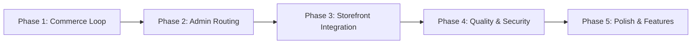

# Val Store — Project Completion Roadmap

**Created:** 2026-01-14  
**Based on:** Analysis from `docs/2026-01-13/`

> [!IMPORTANT]
> **North-Star Metric:** "Paid order completed end-to-end in production with webhook confirmation"
> Until that is achieved, everything else is secondary.

---

## Overview

This roadmap consolidates findings from the January 13th codebase analysis into a structured, phased plan. Tasks are organized by priority (P0 = critical blockers, P1 = important, P2 = quality improvements) with clear milestones.

---

## Phase 1: Make the Store Real (Commerce Loop) 🛒

> **Goal:** Enable customers to complete a purchase from cart to order confirmation.  
> **Priority:** P0 — This is the revenue path. Nothing else matters until this works.  
> **Timeline:** 3-5 days

### 1.1 Implement Order Creation Infrastructure

- [x] **Fix `DrizzleOrderRepository.create()`** ✅
  - File: `src/infrastructure/database/repositories/order.repository.ts`
  - ~~Currently throws: "Order creation not implemented - schema mapping needs address IDs"~~
  - Now inserts into `orders`, `order_items`, and `payments` tables
  - Handle nullable `shippingAddressId`/`billingAddressId` gracefully

- [x] **Create `CreateOrderUseCase`** ✅
  - Location: `src/application/use-cases/checkout/create-order.use-case.ts`
  - Responsibilities:
    - ✅ Validate cart contents (throws if empty)
    - ⏳ Check stock availability (TODO)
    - ✅ Calculate totals server-side (never trust client)
    - ✅ Create order with status `pending`
    - ✅ Create order items
    - ⏳ Reserve inventory (if applicable - TODO)

- [x] **Align Order Status Taxonomy** ✅
  - DB enum includes: `pending`, `processing`, `paid`, `shipped`, `delivered`, `cancelled`, `refunded`
  - ✅ Updated `OrderStatusValueObject` transitions to allow `pending` → `paid`
  - Ensure all layers use the same statuses

### 1.2 Build the Checkout Page

- [x] **Implement `/checkout` page** ✅
  - File: `src/app/(main)/checkout/page.tsx`
  - Multi-step flow:
    1. ✅ Shipping address selection/entry
    2. ✅ Payment method selection (Stripe / COD)
    3. ⏳ Order review (cart summary - TODO)
  - ✅ Call `CreateOrderUseCase` to create pending order
  - ✅ For Stripe: call `trpc.public.checkout.createSession`, redirect to Stripe URL

### 1.3 Fix Stripe Integration

- [x] **Update Stripe metadata** ✅
  - File: `src/application/use-cases/checkout/create-checkout-session.use-case.ts`
  - ✅ Added `userId` to metadata
  - Required for cart clearing in webhook

- [x] **Complete Webhook Handler** ✅
  - File: `src/app/api/webhook/stripe/route.ts`
  - On `checkout.session.completed`:
    - ✅ Sends confirmation email (already works)
    - ✅ Update order to `paid` status
    - ✅ Update `payments` record with Stripe response
    - ✅ Clear cart (uses `userId` from metadata)

### 1.4 Support Cash on Delivery

- [x] **Add COD Payment Flow** ✅
  - ✅ Skip Stripe redirect via `createCodOrder` mutation
  - ✅ Order remains in `pending` status
  - Admin marks as `paid` after delivery

> [!TIP]
> **Enhancement Suggestion:** Add an `Order.paymentMethod` field (`stripe` | `cod`) to distinguish orders for admin fulfillment workflows.

---

## Phase 2: Fix Admin Routing & Structure 🔧

> **Goal:** Consolidate all admin routes under `/admin/*`, fix protection gaps, create missing routes.  
> **Priority:** P0/P1 — Routing collisions and protection gaps are production blockers.  
> **Timeline:** 2-3 days

### 2.1 Restructure Admin Routes

**Decision:** Use `/admin/*` as the canonical admin prefix.

- [x] **Move existing admin routes:** ✅

| Current Location      | New Location          |
| --------------------- | --------------------- |
| `/dashboard`          | `/admin`              |
| `/dashboard/settings` | `/admin/settings`     |
| `/products`           | `/admin/products`     |
| `/products/new`       | `/admin/products/new` |
| `/orders`             | `/admin/orders`       |

- [x] **Create missing detail routes:** ✅
  - [x] `/admin/products/[id]/page.tsx` (edit product)
  - [x] `/admin/orders/[id]/page.tsx` (order detail)

- [x] **Update middleware protection** ✅
  - File: `src/middleware.ts`
  - Changed matcher from `/dashboard/:path*` to `/admin/:path*`

### 2.2 Fix Admin UI Links

- [x] **Update `AdminSidebar.tsx`** ✅
  - Fixed all navigation links to use `/admin/*` prefix
  - Added "Coming Soon" section for unimplemented pages:
    - Inventory, Customers, Reviews, Coupons, Analytics

- [x] **Update `ProductsTable.tsx`** ✅
  - Links already correct: `/admin/products/${product.id}`

- [x] **Update `OrdersTable.tsx` and `RecentOrders.tsx`** ✅
  - Changed `/orders/${order.id}` to `/admin/orders/${order.id}`

- [x] **Update `CreateProductHeader.tsx`** ✅
  - Links already correct

### 2.3 Fix `UserDialog.tsx` Links

- [x] Change "My Orders" from `/orders` to `/account/orders` ✅
- [x] Change `/settings` to `/account/profile` ✅
- [x] Admin link already correct: `/admin` ✅

> [!TIP]
> **Enhancement Suggestion:** Add visual badges to the sidebar for "Coming Soon" features instead of dead links. This sets expectations and reduces confusion.

---

## Phase 3: Wire Storefront to Database 📦

> **Goal:** Replace mock data with real tRPC calls across storefront pages.  
> **Priority:** P1 — Store needs real product data to be functional.  
> **Timeline:** 2-3 days

### 3.1 Product Detail Page

- [x] **Replace mock data in `products/[slug]/page.tsx`** ✅
  - Now uses `getCachedProductBySlug` from database
  - Fetches images, variants, related products
  - Handle 404 for non-existent products

### 3.2 Collections Pages

- [x] **Wire `/collections/all` to database** ✅
  - Now uses `getCachedAllProducts`
  - Displays real products from database

- [ ] **Wire `/collections/[category]` to database**
  - Individual category pages still use hardcoded data
  - Future: Use dynamic [slug] route with `getCachedProductsByCategory`

### 3.3 Search Page

- [x] **Implement `/search` page** ✅
  - Searches products by name/description
  - Proper empty state UI
  - Query parameter support

> [!TIP]
> **Enhancement Suggestion:** The current search does in-memory filtering. Plan for Phase 5: implement PostgreSQL full-text search with `tsvector`/`tsquery` or trigram (`pg_trgm`) for better performance and relevance.

---

## Phase 4: Security, Quality & Testing 🔒

> **Goal:** Add security controls, fix broken authentication links, establish testing baseline.  
> **Priority:** P1 — Required before any public launch.  
> **Timeline:** 3-4 days

### 4.1 Fix Broken Auth Redirects

- [ ] **Fix account layout redirect**
  - File: `src/app/(main)/account/layout.tsx`
  - Change `/auth/login?callbackUrl=/account` to `/login?redirect=/account`

- [ ] **Fix wishlist button redirect**
  - File: `src/components/products/WishlistButton.tsx`
  - Same fix: use `/login` not `/auth/login`

- [ ] **Fix password change link**
  - File: `src/app/(main)/account/profile/page.tsx`
  - Either create `/forgot-password` route or update link

### 4.2 Security Hardening

- [ ] **Add rate limiting**
  - Priority endpoints:
    - `/api/auth/*` (login, signup, password reset)
    - `/api/trpc/public.checkout.*`
  - Consider: `@upstash/ratelimit` or similar

- [ ] **Fix UploadThing authorization**
  - File: `src/app/api/uploadthing/core.ts`
  - `productImage` endpoint only checks session, not admin role
  - Add role check: `if (session?.user?.role !== 'admin') throw ...`

- [ ] **Add security headers**
  - Add to `next.config.js`:
    - `X-Frame-Options: DENY`
    - `X-Content-Type-Options: nosniff`
    - `Referrer-Policy: strict-origin-when-cross-origin`
    - HSTS

### 4.3 Testing Foundation

- [ ] **Set up Vitest**
  - Install: `pnpm add -D vitest @vitest/ui`
  - Create `vitest.config.ts`

- [ ] **Add domain entity tests (3-5 minimum)**
  - `Order` entity state transitions
  - Price/discount calculations
  - Cart validation logic

- [ ] **Add CI pipeline**
  - Create `.github/workflows/ci.yml`
  - Run: `pnpm lint`, `pnpm type-check`, `vitest run`

> [!IMPORTANT]
> **Enhancement Suggestion:** Add a single E2E test (Playwright) for the checkout flow before launch. This catches integration issues that unit tests miss.

---

## Phase 5: Polish, CMS & Dead Links 💅

> **Goal:** Fix remaining UX issues, dead links, and optimize performance.  
> **Priority:** P2 — Important for production quality but not blocking.  
> **Timeline:** 2-3 days

### 5.1 Fix Dead Footer/Navigation Links

**Option A (Recommended):** Create minimal placeholder pages  
**Option B:** Remove links until implemented

- [ ] **Create placeholder pages for:**
  - `/contact`
  - `/shipping`
  - `/returns`
  - `/faq`
  - `/about`
  - `/privacy`
  - `/terms`

- [ ] **Remove or create collection routes:**
  - `/collections/summer-2025`
  - `/collections/essentials`
  - `/collections/best-sellers`

### 5.2 CMS Cache Invalidation

- [ ] **Add `revalidateTag()` calls after admin updates**
  - File: `src/server/routers/admin/settings.ts`
  - After `updateContentSection()`: `revalidateTag('hero-section')`, etc.
  - Currently relies on 60s `unstable_cache` TTL

### 5.3 Performance Fixes

- [ ] **Fix `ServerFeaturedCategories` N+1 query**
  - Currently calls `productRepo.findAll()` per category
  - Add repo method: `countProductsByCategoryIds([...ids])`
  - Single aggregated query instead of N

- [ ] **Fix products router pagination**
  - `public.products.list` fetches all then slices
  - Pass `limit`/`offset` to the repository query

### 5.4 Developer Experience

- [ ] **Replace root `README.md`**
  - Still shows default Next.js template
  - Add: stack overview, env vars, local dev steps, deployment notes

- [ ] **Ensure `.env.example` exists**
  - No secrets, just variable names
  - Add env validation (Zod + `@t3-oss/env-nextjs`)

> [!TIP]
> **Enhancement Suggestion:** Add empty state components for cart, wishlist, search results, and order history. Good empty states dramatically improve perceived quality.

---

## Phase 6: Feature Completion (Future) 🚀

> **Goal:** Implement remaining product features from schema.  
> **Priority:** P2 — Nice-to-have, can be done incrementally after launch.

### 6.1 Coupons System

- [ ] Schema exists — implement validation + application at checkout
- [ ] Admin UI for coupon management

### 6.2 Reviews System

- [ ] Add entity/repository/router
- [ ] Product page integration
- [ ] Admin moderation UI

### 6.3 Inventory Management

- [ ] Admin inventory page
- [ ] Stock tracking with variant-level quantities
- [ ] Low stock alerts

### 6.4 Customer Management (Admin)

- [ ] Admin customers list
- [ ] Customer detail view with order history

### 6.5 Advanced Search

- [ ] Replace in-memory filtering with PostgreSQL full-text search
- [ ] Add filters: price range, categories, attributes
- [ ] Add sorting options

### 6.6 Notifications System

- [ ] Create notifications table in database schema
- [ ] Add notification types: new order, low stock, new review, etc.
- [ ] Admin notifications API (tRPC router)
- [ ] Real-time notification updates (WebSocket or polling)
- [ ] Mark as read/unread functionality
- [ ] Notification dropdown UI in admin header
- [ ] Email notifications for critical alerts (optional)

---

## Quick Reference: File Locations

| Component        | File                                                           |
| ---------------- | -------------------------------------------------------------- |
| Order Repository | `src/infrastructure/database/repositories/order.repository.ts` |
| Checkout Page    | `src/app/(main)/checkout/page.tsx`                             |
| Stripe Webhook   | `src/app/api/webhook/stripe/route.ts`                          |
| Middleware       | `src/middleware.ts`                                            |
| Admin Sidebar    | `src/components/admin/AdminSidebar.tsx`                        |
| User Dialog      | `src/components/UserDialog.tsx`                                |
| Product Detail   | `src/app/(main)/products/[slug]/page.tsx`                      |
| Cache Layer      | `src/lib/cache.ts`                                             |
| Content Schemas  | `src/domain/value-objects/content-schemas.ts`                  |

---

## Summary Checklist

### Phase 1: Commerce Loop (P0)

- [x] Fix `DrizzleOrderRepository.create()` ✅
- [x] Create `CreateOrderUseCase` ✅
- [x] Align order status taxonomy ✅
- [x] Implement `/checkout` page ✅
- [x] Fix Stripe metadata (add `userId`) ✅
- [x] Complete webhook handler ✅
- [x] Support COD payment ✅

### Phase 2: Admin Routing (P0/P1)

- [x] Move all admin routes to `/admin/*` ✅
- [x] Create `/admin/products/[id]` and `/admin/orders/[id]` ✅
- [x] Update middleware matcher ✅
- [x] Fix all admin UI links ✅
- [x] Fix `UserDialog.tsx` links ✅

### Phase 3: Storefront Integration (P1)

- [x] Wire product detail page to database ✅
- [x] Wire collections/all page to database ✅
- [x] Implement search page ✅

### Phase 4: Security & Testing (P1)

- [ ] Fix broken auth redirects
- [ ] Add rate limiting
- [ ] Fix UploadThing authorization
- [ ] Add security headers
- [ ] Set up Vitest + basic tests
- [ ] Add CI pipeline

### Phase 5: Polish (P2)

- [ ] Fix dead links (placeholder pages)
- [ ] Add cache invalidation
- [ ] Fix performance issues
- [ ] Update README

---

> **Total Estimated Time:** 12-18 days (depending on scope of each phase)

_Last updated: 2026-01-19_
