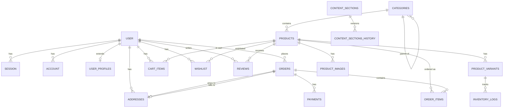

# Val Store - Database Schema Documentation

**Generated:** 2025-12-30  
**ORM:** Drizzle ORM  
**Database:** PostgreSQL 15+

---

## 📊 Overview

| Metric       | Value |
| ------------ | ----- |
| Total Tables | 21    |
| Enums        | 9     |
| Foreign Keys | 25+   |
| Indexes      | 40+   |

---

## 📋 Enums

```sql
-- User roles for authorization
CREATE TYPE user_role AS ENUM ('customer', 'worker', 'admin', 'super_admin');

-- Address types
CREATE TYPE address_type AS ENUM ('shipping', 'billing');

-- Product gender targeting
CREATE TYPE gender AS ENUM ('men', 'women', 'unisex', 'kids');

-- Order lifecycle
CREATE TYPE order_status AS ENUM (
  'pending', 'processing', 'paid', 'shipped', 'delivered', 'cancelled', 'refunded'
);

-- Payment methods
CREATE TYPE payment_method AS ENUM (
  'credit_card', 'debit_card', 'paypal', 'stripe', 'cash_on_delivery'
);

-- Payment status
CREATE TYPE payment_status AS ENUM ('pending', 'completed', 'failed', 'refunded');

-- Discount types
CREATE TYPE discount_type AS ENUM ('percentage', 'fixed');

-- Inventory change types
CREATE TYPE inventory_change_type AS ENUM (
  'restock', 'sale', 'adjustment', 'damaged', 'return'
);

-- Admin notification types
CREATE TYPE notification_type AS ENUM (
  'new_order', 'low_stock', 'new_review', 'failed_payment', 'new_customer'
);
```

---

## 🗄️ Tables

### Authentication (Better Auth)

#### `user`

```sql
CREATE TABLE "user" (
  id TEXT PRIMARY KEY,
  name TEXT,
  email TEXT NOT NULL UNIQUE,
  email_verified BOOLEAN DEFAULT false,
  image TEXT,
  phone TEXT,
  birthday TEXT,
  created_at TIMESTAMP DEFAULT NOW(),
  updated_at TIMESTAMP DEFAULT NOW()
);
```

#### `session`

```sql
CREATE TABLE session (
  id TEXT PRIMARY KEY,
  user_id TEXT NOT NULL REFERENCES "user"(id) ON DELETE CASCADE,
  token TEXT NOT NULL UNIQUE,
  expires_at TIMESTAMP NOT NULL,
  ip_address TEXT,
  user_agent TEXT,
  created_at TIMESTAMP DEFAULT NOW(),
  updated_at TIMESTAMP DEFAULT NOW()
);
```

#### `account`

```sql
CREATE TABLE account (
  id TEXT PRIMARY KEY,
  user_id TEXT NOT NULL REFERENCES "user"(id) ON DELETE CASCADE,
  account_id TEXT NOT NULL,
  provider_id TEXT NOT NULL,
  access_token TEXT,
  refresh_token TEXT,
  access_token_expires_at TIMESTAMP,
  refresh_token_expires_at TIMESTAMP,
  scope TEXT,
  password TEXT,
  created_at TIMESTAMP DEFAULT NOW(),
  updated_at TIMESTAMP DEFAULT NOW()
);
```

#### `verification`

```sql
CREATE TABLE verification (
  id TEXT PRIMARY KEY,
  identifier TEXT NOT NULL,
  value TEXT NOT NULL,
  expires_at TIMESTAMP NOT NULL,
  created_at TIMESTAMP DEFAULT NOW(),
  updated_at TIMESTAMP DEFAULT NOW()
);
```

---

### Extended User Data

#### `user_profiles`

```sql
CREATE TABLE user_profiles (
  id UUID PRIMARY KEY DEFAULT gen_random_uuid(),
  user_id TEXT NOT NULL UNIQUE REFERENCES "user"(id) ON DELETE CASCADE,
  role user_role DEFAULT 'customer' NOT NULL,
  created_at TIMESTAMP DEFAULT NOW() NOT NULL,
  updated_at TIMESTAMP DEFAULT NOW() NOT NULL
);
```

#### `customers`

Real human identity (separate from user accounts)

```sql
CREATE TABLE customers (
  id UUID PRIMARY KEY DEFAULT gen_random_uuid(),
  phone VARCHAR(20) NOT NULL UNIQUE,
  preferred_name VARCHAR(100),
  is_phone_verified BOOLEAN DEFAULT false NOT NULL,
  total_orders INTEGER DEFAULT 0 NOT NULL,
  total_spent DECIMAL(10,2) DEFAULT 0 NOT NULL,
  loyalty_points INTEGER DEFAULT 0 NOT NULL,
  notes TEXT,
  created_at TIMESTAMP DEFAULT NOW() NOT NULL,
  updated_at TIMESTAMP DEFAULT NOW() NOT NULL
);

CREATE UNIQUE INDEX idx_customers_phone ON customers(phone);
```

#### `addresses`

```sql
CREATE TABLE addresses (
  id UUID PRIMARY KEY DEFAULT gen_random_uuid(),
  user_id TEXT NOT NULL REFERENCES "user"(id) ON DELETE CASCADE,
  address_type address_type NOT NULL,
  is_default BOOLEAN DEFAULT false NOT NULL,
  full_name VARCHAR(200) NOT NULL,
  address_line1 VARCHAR(255) NOT NULL,
  address_line2 VARCHAR(255),
  city VARCHAR(100) NOT NULL,
  state VARCHAR(100) NOT NULL,
  postal_code VARCHAR(20) NOT NULL,
  country VARCHAR(100) NOT NULL,
  phone VARCHAR(20) NOT NULL,
  created_at TIMESTAMP DEFAULT NOW() NOT NULL,
  updated_at TIMESTAMP DEFAULT NOW() NOT NULL
);

CREATE INDEX idx_addresses_user_id ON addresses(user_id);
CREATE INDEX idx_addresses_is_default ON addresses(is_default);
```

---

### Product Catalog

#### `categories`

Self-referencing for hierarchy

```sql
CREATE TABLE categories (
  id UUID PRIMARY KEY DEFAULT gen_random_uuid(),
  name VARCHAR(100) NOT NULL,
  slug VARCHAR(100) NOT NULL UNIQUE,
  description TEXT,
  parent_id UUID,  -- Self-reference
  image_url VARCHAR(500),
  display_order INTEGER DEFAULT 0 NOT NULL,
  is_active BOOLEAN DEFAULT true NOT NULL,
  created_at TIMESTAMP DEFAULT NOW() NOT NULL,
  updated_at TIMESTAMP DEFAULT NOW() NOT NULL
);

CREATE INDEX idx_categories_slug ON categories(slug);
CREATE INDEX idx_categories_parent_id ON categories(parent_id);
CREATE INDEX idx_categories_is_active ON categories(is_active);
```

#### `products`

```sql
CREATE TABLE products (
  id UUID PRIMARY KEY DEFAULT gen_random_uuid(),
  name VARCHAR(255) NOT NULL,
  slug VARCHAR(255) NOT NULL UNIQUE,
  description TEXT,
  category_id UUID REFERENCES categories(id) ON DELETE SET NULL,
  sku VARCHAR(100) NOT NULL UNIQUE,
  base_price DECIMAL(10,2) NOT NULL,
  sale_price DECIMAL(10,2),
  cost_price DECIMAL(10,2),
  is_active BOOLEAN DEFAULT true NOT NULL,
  is_featured BOOLEAN DEFAULT false NOT NULL,
  gender gender DEFAULT 'unisex',
  material VARCHAR(255),
  care_instructions TEXT,
  meta_title VARCHAR(255),
  meta_description TEXT,
  created_at TIMESTAMP DEFAULT NOW() NOT NULL,
  updated_at TIMESTAMP DEFAULT NOW() NOT NULL
);

CREATE INDEX idx_products_slug ON products(slug);
CREATE INDEX idx_products_sku ON products(sku);
CREATE INDEX idx_products_category_id ON products(category_id);
CREATE INDEX idx_products_is_active ON products(is_active);
CREATE INDEX idx_products_is_featured ON products(is_featured);
```

#### `product_variants`

```sql
CREATE TABLE product_variants (
  id UUID PRIMARY KEY DEFAULT gen_random_uuid(),
  product_id UUID NOT NULL REFERENCES products(id) ON DELETE CASCADE,
  sku VARCHAR(100) NOT NULL UNIQUE,
  size VARCHAR(50),
  color VARCHAR(50),
  stock_quantity INTEGER DEFAULT 0 NOT NULL,
  price_adjustment DECIMAL(10,2) DEFAULT 0,
  is_available BOOLEAN DEFAULT true NOT NULL,
  created_at TIMESTAMP DEFAULT NOW() NOT NULL,
  updated_at TIMESTAMP DEFAULT NOW() NOT NULL
);

CREATE INDEX idx_variants_product_id ON product_variants(product_id);
CREATE INDEX idx_variants_sku ON product_variants(sku);
CREATE INDEX idx_variants_is_available ON product_variants(is_available);
```

#### `product_images`

```sql
CREATE TABLE product_images (
  id UUID PRIMARY KEY DEFAULT gen_random_uuid(),
  product_id UUID NOT NULL REFERENCES products(id) ON DELETE CASCADE,
  image_url VARCHAR(500) NOT NULL,
  alt_text VARCHAR(255),
  display_order INTEGER DEFAULT 0 NOT NULL,
  is_primary BOOLEAN DEFAULT false NOT NULL,
  created_at TIMESTAMP DEFAULT NOW() NOT NULL
);

CREATE INDEX idx_images_product_id ON product_images(product_id);
CREATE INDEX idx_images_is_primary ON product_images(is_primary);
```

---

### Orders & Payments

#### `orders`

```sql
CREATE TABLE orders (
  id UUID PRIMARY KEY DEFAULT gen_random_uuid(),
  order_number VARCHAR(50) NOT NULL UNIQUE,
  user_id TEXT REFERENCES "user"(id) ON DELETE SET NULL,
  status order_status DEFAULT 'pending' NOT NULL,
  subtotal DECIMAL(10,2) NOT NULL,
  tax_amount DECIMAL(10,2) DEFAULT 0 NOT NULL,
  shipping_amount DECIMAL(10,2) DEFAULT 0 NOT NULL,
  discount_amount DECIMAL(10,2) DEFAULT 0 NOT NULL,
  total_amount DECIMAL(10,2) NOT NULL,
  currency VARCHAR(3) DEFAULT 'USD' NOT NULL,
  shipping_address_id UUID REFERENCES addresses(id),
  billing_address_id UUID REFERENCES addresses(id),
  customer_notes TEXT,
  admin_notes TEXT,
  created_at TIMESTAMP DEFAULT NOW() NOT NULL,
  updated_at TIMESTAMP DEFAULT NOW() NOT NULL,
  shipped_at TIMESTAMP,
  delivered_at TIMESTAMP
);

CREATE INDEX idx_orders_user_id ON orders(user_id);
CREATE INDEX idx_orders_order_number ON orders(order_number);
CREATE INDEX idx_orders_status ON orders(status);
CREATE INDEX idx_orders_created_at ON orders(created_at);
```

#### `order_items`

```sql
CREATE TABLE order_items (
  id UUID PRIMARY KEY DEFAULT gen_random_uuid(),
  order_id UUID NOT NULL REFERENCES orders(id) ON DELETE CASCADE,
  product_id UUID REFERENCES products(id) ON DELETE SET NULL,
  variant_id UUID REFERENCES product_variants(id) ON DELETE SET NULL,
  product_name VARCHAR(255) NOT NULL,  -- Snapshot
  variant_details VARCHAR(255),         -- Snapshot
  quantity INTEGER NOT NULL,
  unit_price DECIMAL(10,2) NOT NULL,
  total_price DECIMAL(10,2) NOT NULL,
  created_at TIMESTAMP DEFAULT NOW() NOT NULL
);

CREATE INDEX idx_order_items_order_id ON order_items(order_id);
CREATE INDEX idx_order_items_product_id ON order_items(product_id);
```

#### `payments`

```sql
CREATE TABLE payments (
  id UUID PRIMARY KEY DEFAULT gen_random_uuid(),
  order_id UUID NOT NULL REFERENCES orders(id) ON DELETE CASCADE,
  payment_method payment_method NOT NULL,
  payment_status payment_status DEFAULT 'pending' NOT NULL,
  amount DECIMAL(10,2) NOT NULL,
  currency VARCHAR(3) DEFAULT 'USD' NOT NULL,
  transaction_id VARCHAR(255),
  payment_gateway_response TEXT,
  created_at TIMESTAMP DEFAULT NOW() NOT NULL,
  updated_at TIMESTAMP DEFAULT NOW() NOT NULL
);

CREATE INDEX idx_payments_order_id ON payments(order_id);
CREATE INDEX idx_payments_status ON payments(payment_status);
CREATE INDEX idx_payments_transaction_id ON payments(transaction_id);
```

---

### Shopping Features

#### `cart_items`

```sql
CREATE TABLE cart_items (
  id UUID PRIMARY KEY DEFAULT gen_random_uuid(),
  user_id TEXT NOT NULL REFERENCES "user"(id) ON DELETE CASCADE,
  product_id UUID NOT NULL REFERENCES products(id) ON DELETE CASCADE,
  variant_id UUID REFERENCES product_variants(id) ON DELETE CASCADE,
  quantity INTEGER DEFAULT 1 NOT NULL,
  created_at TIMESTAMP DEFAULT NOW() NOT NULL,
  updated_at TIMESTAMP DEFAULT NOW() NOT NULL
);

CREATE INDEX idx_cart_user_id ON cart_items(user_id);
CREATE INDEX idx_cart_product_id ON cart_items(product_id);
```

#### `wishlist`

```sql
CREATE TABLE wishlist (
  id UUID PRIMARY KEY DEFAULT gen_random_uuid(),
  user_id TEXT NOT NULL REFERENCES "user"(id) ON DELETE CASCADE,
  product_id UUID NOT NULL REFERENCES products(id) ON DELETE CASCADE,
  created_at TIMESTAMP DEFAULT NOW() NOT NULL
);

CREATE INDEX idx_wishlist_user_id ON wishlist(user_id);
CREATE INDEX idx_wishlist_product_id ON wishlist(product_id);
CREATE UNIQUE INDEX idx_wishlist_unique ON wishlist(user_id, product_id);
```

---

### Reviews & Coupons

#### `reviews`

```sql
CREATE TABLE reviews (
  id UUID PRIMARY KEY DEFAULT gen_random_uuid(),
  product_id UUID NOT NULL REFERENCES products(id) ON DELETE CASCADE,
  user_id TEXT NOT NULL REFERENCES "user"(id) ON DELETE CASCADE,
  order_id UUID REFERENCES orders(id) ON DELETE SET NULL,
  rating INTEGER NOT NULL,
  title VARCHAR(255),
  comment TEXT,
  is_verified_purchase BOOLEAN DEFAULT false NOT NULL,
  is_approved BOOLEAN DEFAULT false NOT NULL,
  created_at TIMESTAMP DEFAULT NOW() NOT NULL,
  updated_at TIMESTAMP DEFAULT NOW() NOT NULL
);

CREATE INDEX idx_reviews_product_id ON reviews(product_id);
CREATE INDEX idx_reviews_user_id ON reviews(user_id);
CREATE INDEX idx_reviews_is_approved ON reviews(is_approved);
```

#### `coupons`

```sql
CREATE TABLE coupons (
  id UUID PRIMARY KEY DEFAULT gen_random_uuid(),
  code VARCHAR(50) NOT NULL UNIQUE,
  description TEXT,
  discount_type discount_type NOT NULL,
  discount_value DECIMAL(10,2) NOT NULL,
  min_purchase_amount DECIMAL(10,2),
  max_discount_amount DECIMAL(10,2),
  usage_limit INTEGER,
  usage_count INTEGER DEFAULT 0 NOT NULL,
  per_user_limit INTEGER DEFAULT 1 NOT NULL,
  is_active BOOLEAN DEFAULT true NOT NULL,
  starts_at TIMESTAMP,
  expires_at TIMESTAMP,
  created_at TIMESTAMP DEFAULT NOW() NOT NULL,
  updated_at TIMESTAMP DEFAULT NOW() NOT NULL
);

CREATE INDEX idx_coupons_code ON coupons(code);
CREATE INDEX idx_coupons_is_active ON coupons(is_active);
```

---

### Inventory & Notifications

#### `inventory_logs`

```sql
CREATE TABLE inventory_logs (
  id UUID PRIMARY KEY DEFAULT gen_random_uuid(),
  variant_id UUID NOT NULL REFERENCES product_variants(id) ON DELETE CASCADE,
  change_type inventory_change_type NOT NULL,
  quantity_change INTEGER NOT NULL,
  previous_quantity INTEGER NOT NULL,
  new_quantity INTEGER NOT NULL,
  reason TEXT,
  created_by TEXT REFERENCES "user"(id),
  created_at TIMESTAMP DEFAULT NOW() NOT NULL
);

CREATE INDEX idx_inventory_variant_id ON inventory_logs(variant_id);
CREATE INDEX idx_inventory_created_at ON inventory_logs(created_at);
```

#### `admin_notifications`

```sql
CREATE TABLE admin_notifications (
  id UUID PRIMARY KEY DEFAULT gen_random_uuid(),
  admin_user_id TEXT NOT NULL REFERENCES "user"(id) ON DELETE CASCADE,
  notification_type notification_type NOT NULL,
  title VARCHAR(255) NOT NULL,
  message TEXT NOT NULL,
  related_entity_id UUID,
  is_read BOOLEAN DEFAULT false NOT NULL,
  created_at TIMESTAMP DEFAULT NOW() NOT NULL
);

CREATE INDEX idx_notifications_admin_user_id ON admin_notifications(admin_user_id);
CREATE INDEX idx_notifications_is_read ON admin_notifications(is_read);
CREATE INDEX idx_notifications_created_at ON admin_notifications(created_at);
```

---

### CMS Tables

#### `site_settings`

Singleton table for global config

```sql
CREATE TABLE site_settings (
  id UUID PRIMARY KEY DEFAULT gen_random_uuid(),
  store_name VARCHAR(255) DEFAULT 'Val Store' NOT NULL,
  store_tagline VARCHAR(255),
  logo_url VARCHAR(500),
  favicon_url VARCHAR(500),
  contact_email VARCHAR(255),
  contact_phone VARCHAR(50),
  instagram_url VARCHAR(255),
  facebook_url VARCHAR(255),
  twitter_url VARCHAR(255),
  tiktok_url VARCHAR(255),
  currency VARCHAR(3) DEFAULT 'USD' NOT NULL,
  locale VARCHAR(10) DEFAULT 'en-US' NOT NULL,
  timezone VARCHAR(50) DEFAULT 'UTC' NOT NULL,
  default_meta_title VARCHAR(255),
  default_meta_description TEXT,
  updated_at TIMESTAMP DEFAULT NOW() NOT NULL,
  updated_by TEXT REFERENCES "user"(id) ON DELETE SET NULL
);
```

#### `content_sections`

```sql
CREATE TABLE content_sections (
  id UUID PRIMARY KEY DEFAULT gen_random_uuid(),
  section_type VARCHAR(50) NOT NULL UNIQUE,
  content TEXT NOT NULL,  -- JSON
  display_order INTEGER DEFAULT 0 NOT NULL,
  is_active BOOLEAN DEFAULT true NOT NULL,
  version INTEGER DEFAULT 1 NOT NULL,
  updated_at TIMESTAMP DEFAULT NOW() NOT NULL,
  updated_by TEXT REFERENCES "user"(id) ON DELETE SET NULL
);

CREATE UNIQUE INDEX idx_content_sections_type ON content_sections(section_type);
CREATE INDEX idx_content_sections_is_active ON content_sections(is_active);
```

#### `content_sections_history`

```sql
CREATE TABLE content_sections_history (
  id UUID PRIMARY KEY DEFAULT gen_random_uuid(),
  section_id UUID NOT NULL REFERENCES content_sections(id) ON DELETE CASCADE,
  section_type VARCHAR(50) NOT NULL,
  content TEXT NOT NULL,  -- JSON
  version INTEGER NOT NULL,
  created_at TIMESTAMP DEFAULT NOW() NOT NULL,
  created_by TEXT REFERENCES "user"(id) ON DELETE SET NULL
);

CREATE INDEX idx_content_history_section_id ON content_sections_history(section_id);
CREATE INDEX idx_content_history_version ON content_sections_history(version);
```

#### `featured_items`

```sql
CREATE TABLE featured_items (
  id UUID PRIMARY KEY DEFAULT gen_random_uuid(),
  item_type VARCHAR(20) NOT NULL,  -- 'product' | 'category'
  item_id UUID NOT NULL,
  section VARCHAR(50) NOT NULL,
  display_order INTEGER DEFAULT 0 NOT NULL,
  is_active BOOLEAN DEFAULT true NOT NULL,
  created_at TIMESTAMP DEFAULT NOW() NOT NULL,
  updated_at TIMESTAMP DEFAULT NOW() NOT NULL
);

CREATE INDEX idx_featured_section ON featured_items(section, is_active, display_order);
CREATE INDEX idx_featured_item ON featured_items(item_type, item_id);
```

---

## 🔗 Entity Relationship Diagram



---

_Database documentation generated by Senior Full-Stack Developer_
