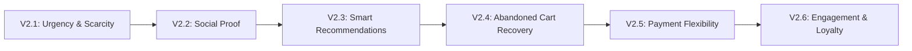

# Val Store v2.0 — Feature Enhancement Roadmap

**Created:** 2026-01-14  
**Status:** Planning Phase

> [!NOTE]
> This document outlines the V2.0 features designed to maximize **conversion, revenue, and customer retention**. These are the features that separate a "working store" from a "store that prints money."

---

## 🎯 North Star Metrics for V2.0

| Metric                    | Target Improvement   |
| ------------------------- | -------------------- |
| Conversion Rate           | +25-40%              |
| Average Order Value       | +15-30%              |
| Cart Abandonment Recovery | +5-15% of lost sales |
| Customer Return Rate      | +20%                 |

---

## Phase Overview



---

## 📁 Document Index

| Doc                                                      | Feature Area                           | Status      |
| -------------------------------------------------------- | -------------------------------------- | ----------- |
| [01-urgency-scarcity.md](./01-urgency-scarcity.md)       | Low stock, countdowns, flash sales     | ✅ Complete |
| [02-social-proof.md](./02-social-proof.md)               | Reviews, ratings, trust badges, UGC    | ✅ Complete |
| [03-recommendations.md](./03-recommendations.md)         | Also bought, similar, personalized     | ✅ Complete |
| [04-cart-recovery.md](./04-cart-recovery.md)             | Email sequences, exit-intent popup     | ✅ Complete |
| [05-payment-flexibility.md](./05-payment-flexibility.md) | BNPL (Tabby), gift cards, wallet       | ✅ Complete |
| [06-loyalty-engagement.md](./06-loyalty-engagement.md)   | Points, tiers, referrals, gamification | ✅ Complete |
| [07-ux-improvements.md](./07-ux-improvements.md)         | Quick view, size guides, WhatsApp      | ✅ Complete |
| [08-stripe-integration.md](./08-stripe-integration.md)   | Products sync, multi-item checkout     | ✅ Complete |

---

## Priority Matrix

### 🔴 Immediate Impact (Implement First)

| Feature               | Effort | Revenue Impact       | Timeline |
| --------------------- | ------ | -------------------- | -------- |
| Abandoned Cart Emails | Medium | 5-15% recovery       | 2-3 days |
| Buy Now Pay Later     | Low\*  | +20-30% conversion   | 1-2 days |
| Reviews with Photos   | High   | Trust → Sales        | 5-7 days |
| WhatsApp Chat Button  | Low    | Pre-sales conversion | 1 day    |

\*Low effort if using Tabby/Tamara SDK

### 🟡 High Value (Second Wave)

| Feature                 | Effort | Revenue Impact       | Timeline |
| ----------------------- | ------ | -------------------- | -------- |
| Product Recommendations | High   | +10-30% AOV          | 5-7 days |
| Low Stock Badges        | Low    | Urgency → conversion | 1 day    |
| Exit-Intent Popups      | Medium | Lead capture         | 2-3 days |
| Recently Viewed         | Low    | Re-engagement        | 1 day    |

### 🟢 Polish & Delight (Third Wave)

| Feature          | Effort | Revenue Impact  | Timeline  |
| ---------------- | ------ | --------------- | --------- |
| Loyalty Program  | High   | Retention       | 7-10 days |
| Gift Cards       | Medium | Pure profit     | 3-4 days  |
| Size Guide Tool  | Medium | Reduces returns | 2-3 days  |
| Quick View Modal | Medium | UX improvement  | 2-3 days  |

---

## Quick Wins Checklist

These can each be done in under a day:

- [ ] "Free shipping over X" announcement bar
- [ ] Trust badges at checkout (SSL, payment icons)
- [ ] Stock indicators on product cards
- [ ] Add-to-cart success animation
- [ ] WhatsApp floating button
- [ ] "You might also like" placeholder section
- [ ] First-time visitor discount popup

---

## Technical Considerations

### New Database Tables Needed

```sql
-- Reviews system
CREATE TABLE reviews (...)
CREATE TABLE review_images (...)

-- Loyalty program
CREATE TABLE loyalty_points (...)
CREATE TABLE loyalty_transactions (...)
CREATE TABLE loyalty_tiers (...)

-- Gift cards
CREATE TABLE gift_cards (...)
CREATE TABLE gift_card_transactions (...)

-- Cart recovery
CREATE TABLE abandoned_carts (...)
CREATE TABLE recovery_emails (...)
```

### New Integrations

| Service                  | Purpose               | Priority  |
| ------------------------ | --------------------- | --------- |
| Tabby / Tamara           | Buy Now Pay Later     | 🔴 High   |
| Resend / SendGrid        | Abandoned cart emails | 🔴 High   |
| WhatsApp Business API    | Live chat             | 🔴 High   |
| Cloudinary / UploadThing | Review image uploads  | 🟡 Medium |
| Algolia / Meilisearch    | Advanced search       | 🟢 Low    |

---

## Success Metrics Tracking

After implementing each feature, measure:

1. **Conversion Rate** (orders / visitors)
2. **Average Order Value** (revenue / orders)
3. **Cart Abandonment Rate** (abandoned / started)
4. **Customer Return Rate** (repeat customers / total)
5. **Time to Purchase** (first visit → order)

---

_This is a living document. Each feature will get its own detailed spec in this folder._
